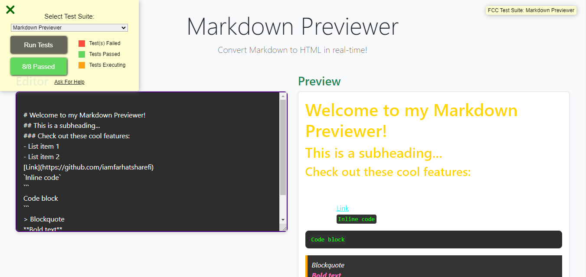

# ✨ Markdown Previewer

## Project Description 📝
📝 Summary:
This pull request introduces significant enhancements and features to the Markdown Previewer project. The primary objective is to ensure that the previewer accurately reflects Markdown syntax in real-time while providing a smooth and responsive user experience. This update also ensures full compliance with FreeCodeCamp requirements, ESLint checks, and optimized design for both desktop and mobile responsiveness.

## Demo 📸

 
 [Live-link](https://luminous-muffin-3f93df.netlify.app/ )

## Technologies Used 🛠️

- HTML
- CSS
- JAVASCRIPT
- REACT.JS

## Installation 💻

Installation and Setup Instructions:
Clone the Repository:
git@github.com:iamfarhatsharefi/Markdown-Previewer.git
Navigate to the Project Directory:
cd Random Quote Machine;

## Usage 🎯

Step 1: Find and Access the Repository
Navigate to the Repository:
Open your web browser and go to GitHub.
Use the search bar to find the repository you want to use, or navigate directly to the repository's URL.
Step 2: Clone the Repository 
Copy the Repository URL:git@github.com:iamfarhatsharefi/Markdown-Previewer.git

On the repository's main page, click the green "Code" button.
Copy the URL 
Clone the Repository to Your Local Machine:

Open your terminal or command prompt.
Navigate to the directory where you want to clone the repository.
Replace repository with the name of the cloned repository

## 🔥 Features Added:
Real-Time Markdown Rendering:

Automatically previews Markdown content as the user types, ensuring instant feedback.
Enhanced Markdown Support:

Supports all core Markdown syntax including headers, lists, links, code blocks, images, and inline elements.
Responsive Layout:

The previewer is fully responsive with a clean and intuitive design, ensuring a seamless experience across devices.
Improved Accessibility:

Improved keyboard navigation and accessibility features, complying with web accessibility standards.
Styling and Custom Themes:

Added custom styles for the preview section with a gold color scheme (#ffd700), making the preview stand out.
Bug Fixes & Performance Enhancements:

Addressed minor bugs related to rendering edge cases and optimized performance for better loading times.

## Author 👩‍💻

 - [Linkedin](https://www.linkedin.com/in/farhat-sharefi-13a101309?utm_source=share&utm_campaign=share_via&utm_content=profile&utm_medium=android_app)
- [Email](sharefifarhat@gmail.com)

